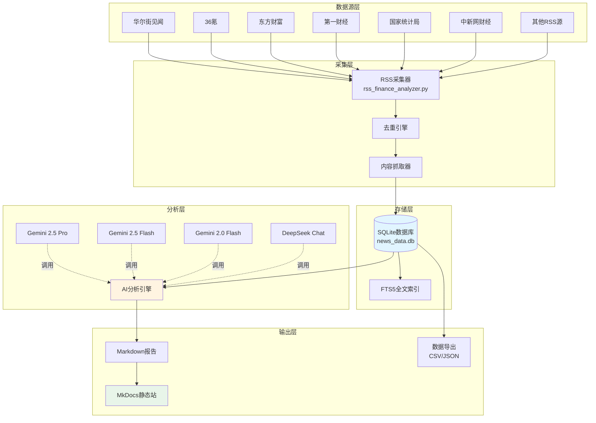
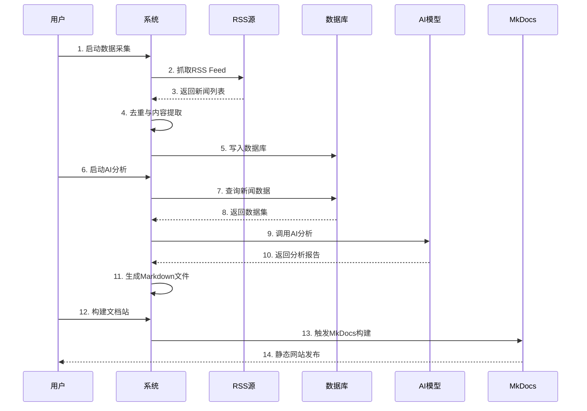

# 财经新闻采集与 AI 分析系统

<div align="center">

**一个生产级的智能财经新闻数据管道**

*多源数据采集 · 智能存储 · AI深度分析 · 自动化报告生成*

---

</div>

## 📖 项目简介

这是一个完整的财经新闻智能分析系统，通过自动化数据采集、标准化存储和 AI 驱动的深度分析，帮助投资者和研究人员快速获取市场洞察。系统支持多个主流财经媒体的 RSS 订阅，能够自动抓取、去重、分析并生成专业的 Markdown 分析报告。

### 核心价值

- 🎯 **节省时间**：自动化采集和分析，从数十个来源每日获取上百条财经资讯
- 🧠 **深度洞察**：利用 AI 大模型进行语义分析，发现市场趋势和投资机会  
- 📊 **数据沉淀**：SQLite 数据库持久化存储，支持历史数据查询和回溯分析
- 🔄 **灵活定制**：支持自定义数据源、分析维度和输出格式
- 🚀 **开箱即用**：完整的虚拟环境配置和一键启动脚本，3分钟即可运行

---

## 🌟 系统特色

### 数据采集层
- **多源 RSS 采集**：支持 20+ 主流财经媒体（华尔街见闻、36氪、东方财富、第一财经等）
- **智能内容抓取**：支持正文和摘要双模式，正文抓取默认不截断保证完整性
- **增量更新机制**：自动去重，避免重复采集，支持断点续传
- **灵活过滤规则**：支持按来源、关键词、日期范围等多维度筛选

### 数据存储层
- **标准化数据库**：SQLite 统一存储，表结构清晰，支持 SQL 查询
- **全文检索支持**：FTS5 全文索引，支持复杂的语义搜索
- **多格式导出**：支持 CSV、JSON 格式导出，方便数据分析和可视化
- **历史数据归档**：按日期自动归档，方便历史回溯

### AI 分析层
- **多模型支持**：集成 Gemini 系列和 DeepSeek 模型，可灵活切换
- **智能字段选择**：支持摘要优先、正文优先、智能选择三种模式
- **专业分析框架**：内置财经分析 Prompt，生成结构化的行业分析和投资建议
- **成本控制机制**：支持文章数量和字符限制，平衡分析质量和成本

### 展示发布层
- **MkDocs 文档站**：自动生成美观的静态网站，支持 Material 主题
- **响应式设计**：完美支持移动端和桌面端浏览
- **一键部署**：支持本地预览和 GitHub Pages 在线部署
- **全文搜索**：内置搜索引擎，快速定位历史报告

---

## 📊 系统架构

### 数据流向图



### 技术架构

| 层级 | 技术栈 | 说明 |
|------|--------|------|
| **应用层** | Python 3.12+ | 核心开发语言 |
| **数据采集** | feedparser, requests, BeautifulSoup4 | RSS解析与内容抓取 |
| **数据存储** | SQLite (FTS5) | 轻量级关系数据库 |
| **AI引擎** | Google Gemini API, DeepSeek API | 大语言模型 |
| **文档生成** | MkDocs + Material Theme | 静态网站生成 |
| **依赖管理** | venv + requirements.txt | 虚拟环境隔离 |

---

## 🚀 快速开始

### 前置要求

- Python 3.10 或更高版本
- 至少一个 AI API Key（Gemini 或 DeepSeek）
- 互联网连接（用于数据采集）

### 方式一：一键启动（推荐）

```bash
# macOS/Linux
./start.sh

# Windows
start.bat
```

一键脚本会自动完成：
- ✅ Python 环境检查
- ✅ 虚拟环境创建与激活
- ✅ 依赖包安装
- ✅ 提供交互式菜单

### 方式二：手动安装

```bash
# 1. 克隆项目
git clone https://github.com/yourusername/Financial-report.git
cd Financial-report

# 2. 激活虚拟环境（自动安装依赖）
./activate.sh                    # Linux/macOS
activate.bat                     # Windows

# 3. 配置 API 密钥
cp config/config.example.yml config/config.yml
# 编辑 config/config.yml，填写你的 API Key

# 4. 运行交互式脚本
python scripts/interactive_runner.py
```

### 配置说明

编辑 `config/config.yml`：

```yaml
api_keys:
  gemini: "YOUR_GEMINI_API_KEY"      # Google AI Studio 获取
  deepseek: "YOUR_DEEPSEEK_API_KEY"  # DeepSeek 官网获取

notify:
  server_chan_keys:                   # 可选：Server酱消息推送
    - "SCT_xxx_1"
    - "SCT_xxx_2"
```

> 💡 **获取 API Key**  
> - Gemini: https://aistudio.google.com/app/apikey  
> - DeepSeek: https://platform.deepseek.com/api_keys

---

## 📈 使用流程

### 完整工作流



### 典型使用场景

#### 场景1：每日市场分析（推荐）

```bash
# 1. 自动抓取今日新闻（摘要和正文都会保存到数据库）
python scripts/rss_finance_analyzer.py --fetch-content

# 2. AI 分析生成报告（默认使用摘要，速度快且可靠）
python scripts/ai_analyze.py

# 3. 本地预览报告
mkdocs serve
```

> 💡 **为什么推荐摘要模式？**  
> - 成功率更高：85.7% vs 76.5%（正文）
> - 速度更快：无需额外HTTP请求
> - 质量足够：大部分RSS摘要包含1000+字符
> - 零维护：不受网站改版影响

#### 场景2：专题研究

```bash
# 1. 抓取指定来源的历史数据
python scripts/rss_finance_analyzer.py --only-source "华尔街见闻,36氪"

# 2. 按关键词和日期范围分析
python scripts/ai_analyze.py \
  --start 2025-10-01 \
  --end 2025-10-10 \
  --filter-keyword "人工智能,芯片,半导体" \
  --content-field content \
  --max-articles 30

# 3. 导出原始数据用于二次分析
python scripts/query_news_by_date.py \
  --start 2025-10-01 \
  --end 2025-10-10 \
  --format json \
  --output research_data.json \
  --include-content
```

#### 场景3：成本优化

```bash
# 使用摘要模式 + 限制字符数和文章数
python scripts/ai_analyze.py \
  --content-field summary \
  --max-articles 50 \
  --max-chars 100000
```

---

## 🔧 核心功能详解

### 1. 数据采集

**支持的数据源**（20+ 个）：
- 华尔街见闻（全球快讯、深度分析）
- 36氪（科技创投资讯）
- 东方财富（A股市场动态）
- 第一财经（权威财经报道）
- 国家统计局（官方经济数据）
- 中新网财经（宏观经济新闻）
- 新浪财经、网易财经、腾讯财经等

**关键参数**：
```bash
--fetch-content         # 抓取完整正文（推荐）
--content-max-length N  # 正文最大长度（0=不截断）
--only-source "来源1,来源2"  # 仅抓取指定来源
```

### 2. 数据查询与导出

**按日期查询**：
```bash
python scripts/query_news_by_date.py --start 2025-10-01 --end 2025-10-10
```

**全文检索**：
```bash
python scripts/query_news_by_date.py --search "新能源 OR 电动车"
```

**导出 JSON**：
```bash
python scripts/query_news_by_date.py \
  --format json \
  --output export.json \
  --include-content  # 包含正文
```

### 3. AI 分析

**字段选择策略**：

| 模式 | 使用场景 | 优势 | 劣势 |
|------|---------|------|------|
| `summary`（⭐推荐） | 日常快速分析 | 速度快、成功率高85.7%、适合大批量 | 相对简洁 |
| `content` | 深度专题研究 | 信息全面、分析深入 | 耗时长、成功率76.5% |
| `auto` | 通用场景 | 自动平衡质量和成本 | 需要调优阈值 |

**推荐使用摘要模式**：测试表明RSS摘要字段质量很高（平均1000+字符），足够支持AI深度分析，且成功率比正文提取更高。交互式脚本已默认使用摘要模式。

**高级过滤**：
```bash
python scripts/ai_analyze.py \
  --filter-source "华尔街见闻,第一财经" \
  --filter-keyword "央行,货币政策,降息" \
  --max-articles 40 \
  --content-field summary
```

**切换 AI 模型**：
```bash
# 使用 Gemini
python scripts/ai_analyze.py

# 使用 DeepSeek（成本更低）
python scripts/ai_analyze_deepseek.py
```

### 4. 文档网站

**本地预览**：
```bash
mkdocs serve
# 访问 http://127.0.0.1:8000
```

**构建部署**：
```bash
bash scripts/deploy.sh
# 生成静态文件到 site/ 目录
```

**自动部署到 GitHub Pages**：
项目配置了自动化工作流，推送到 `main` 分支后会自动部署。

---

## 📁 项目结构

```
Financial-report/
├── config/                          # 配置目录
│   ├── config.example.yml           # 配置模板
│   └── config.yml                   # 实际配置（gitignore）
│
├── data/                            # 数据目录
│   ├── news_data.db                 # SQLite 主数据库
│   └── http_cache.json              # HTTP 缓存
│
├── docs/                            # 文档目录
│   ├── index.md                     # 文档首页
│   ├── archive/                     # 历史报告归档
│   │   └── YYYY-MM/YYYY-MM-DD/
│   │       ├── rss_data/            # RSS 原始数据
│   │       ├── news_content/        # 新闻正文
│   │       ├── reports/             # AI 分析报告
│   │       └── collected_data.json  # 每日数据备份
│   └── prompts/                     # AI Prompt 模板
│
├── scripts/                         # 脚本目录
│   ├── rss_finance_analyzer.py      # RSS 采集器
│   ├── query_news_by_date.py        # 数据查询工具
│   ├── ai_analyze.py                # Gemini 分析引擎
│   ├── ai_analyze_deepseek.py       # DeepSeek 分析引擎
│   ├── interactive_runner.py        # 交互式运行器
│   ├── deploy.sh                    # 部署脚本
│   ├── generate_mkdocs_nav.py       # 导航生成器
│   ├── monitor_data_quality.py      # 数据质量监控
│   ├── config/
│   │   └── rss.json                 # RSS 源配置
│   └── utils/                       # 工具模块
│       ├── config_manager.py        # 配置管理
│       ├── db_manager.py            # 数据库管理
│       ├── deduplication.py         # 去重引擎
│       ├── logger.py                # 日志系统
│       └── print_utils.py           # 输出美化
│
├── site/                            # 静态网站输出（gitignore）
├── venv/                            # Python 虚拟环境（gitignore）
├── logs/                            # 日志目录
│
├── mkdocs.yml                       # MkDocs 配置
├── requirements.txt                 # Python 依赖
├── start.sh / start.bat             # 一键启动脚本
├── activate.sh / activate.bat       # 虚拟环境激活脚本
└── README.md                        # 项目说明
```

---

## 🎯 应用场景

### 个人投资者
- **每日晨报**：自动生成当日市场热点分析
- **行业跟踪**：按关键词订阅特定行业资讯（如新能源、AI、半导体）
- **投资决策**：通过 AI 分析发现市场情绪和潜在机会

### 财经研究员
- **数据采集**：自动化采集多源数据，节省手动搜集时间
- **专题研究**：按时间范围和关键词过滤，快速构建研究语料
- **报告生成**：利用 AI 快速生成初稿，提高写作效率

### 量化团队
- **另类数据**：将新闻情绪作为量化因子
- **事件驱动**：捕捉突发新闻，触发交易策略
- **回测研究**：历史新闻数据库支持策略回测

### 学习研究
- **了解 AI 应用**：学习如何将 LLM 应用于金融分析
- **数据工程实践**：掌握数据采集、存储、处理的完整流程
- **开源贡献**：参与项目开发，提升技术能力

---

## 🛠️ 高级配置

### RSS 源自定义

编辑 `scripts/config/rss.json`：

```json
{
  "自定义来源": {
    "url": "https://example.com/rss",
    "charset": "utf-8",
    "category": "财经"
  }
}
```

### 分析 Prompt 自定义

编辑 `task/financial_analysis_prompt_pro.md` 调整分析框架：

```markdown
# 财经分析框架

## 分析维度
1. 宏观经济
2. 行业动态
3. 市场情绪
...
```

### 数据库查询示例

```python
import sqlite3

conn = sqlite3.connect('data/news_data.db')
cursor = conn.cursor()

# 查询今日新闻数量
cursor.execute("""
    SELECT source, COUNT(*) as count
    FROM news_articles
    WHERE collection_date = date('now')
    GROUP BY source
""")

for row in cursor.fetchall():
    print(f"{row[0]}: {row[1]} 条")
```

---

## 📊 性能指标

### 数据采集性能

| 指标 | 数值 |
|------|------|
| 支持数据源 | 20+ 个 |
| 单次采集量 | 100-300 条/次 |
| 采集频率 | 支持定时任务（推荐每日） |
| 去重准确率 | 99%+（基于URL和标题） |

### AI 分析性能

| 模型 | 分析速度 | 成本估算 | 适用场景 |
|------|---------|---------|---------|
| Gemini 2.0 Flash | ⚡⚡⚡ 快 | 💰 低 | 日常快速分析 |
| Gemini 2.5 Flash | ⚡⚡ 中等 | 💰💰 中等 | 平衡质量和成本 |
| Gemini 2.5 Pro | ⚡ 较慢 | 💰💰💰 高 | 深度专题研究 |
| DeepSeek Chat | ⚡⚡⚡ 快 | 💰 极低 | 成本敏感场景 |

> 💡 **成本优化建议**  
> 1. 优先使用 `summary` 字段进行分析  
> 2. 合理设置 `--max-articles` 和 `--max-chars` 参数  
> 3. 对于大规模分析，推荐使用 DeepSeek 模型

---

## 🔄 更新日志

### v1.2.0 (2025-10-10)
- ✨ 新增 DeepSeek 模型支持，大幅降低分析成本
- ✨ 新增智能字段选择功能（summary/content/auto）
- 🐛 修复长文本分析时的 Token 超限问题
- 📝 完善交互式脚本的用户提示信息

### v1.1.0 (2025-09-30)
- ✨ 集成 MkDocs 文档生成功能
- ✨ 新增虚拟环境一键配置脚本
- ✨ 优化打印输出，增强用户体验
- 📝 完善项目文档和使用指南

### v1.0.0 (2025-09-28)
- 🎉 系统基础架构搭建完成
- ✅ 实现多源 RSS 采集
- ✅ 实现 SQLite 数据存储
- ✅ 实现 Gemini AI 分析
- ✅ 实现 Markdown 报告生成

---

## 🤝 贡献指南

欢迎提交 Issue 和 Pull Request！

### 开发环境设置

```bash
# 1. Fork 项目并克隆
git clone https://github.com/yourusername/Financial-report.git
cd Financial-report

# 2. 创建开发分支
git checkout -b feature/your-feature-name

# 3. 激活虚拟环境并安装依赖
./activate.sh

# 4. 进行开发...

# 5. 提交更改
git commit -am "Add your feature"
git push origin feature/your-feature-name

# 6. 创建 Pull Request
```

### 贡献方向

- 🌐 **新数据源**：添加更多财经 RSS 源
- 🤖 **新 AI 模型**：集成其他 LLM（如 Claude、GPT-4）
- 📊 **数据可视化**：添加图表展示功能
- 🔔 **通知推送**：增强消息通知功能
- 🧪 **单元测试**：提高代码测试覆盖率

---

## ❓ 常见问题

<details>
<summary><b>Q1：需要哪些 API Key？</b></summary>

至少需要 Gemini 或 DeepSeek 其中一个 API Key。两者都配置可以灵活切换使用。

- Gemini API Key：https://aistudio.google.com/app/apikey（免费额度较大）
- DeepSeek API Key：https://platform.deepseek.com/api_keys（成本更低）
</details>

<details>
<summary><b>Q2：数据采集失败怎么办？</b></summary>

1. 检查网络连接是否正常
2. 检查 RSS 源是否可访问（部分源可能需要代理）
3. 查看 `logs/error.log` 获取详细错误信息
4. 尝试使用 `--only-source` 参数排查具体是哪个源出问题
</details>

<details>
<summary><b>Q3：AI 分析报告质量不理想？</b></summary>

1. 尝试切换到 `--content-field content` 使用正文分析
2. 调整 `task/financial_analysis_prompt_pro.md` 优化 Prompt
3. 增加 `--max-articles` 参数提供更多数据样本
4. 尝试不同的 AI 模型（Pro 模型通常质量更高）
</details>

<details>
<summary><b>Q4：如何定时自动运行？</b></summary>

**Linux/macOS Crontab**:
```bash
# 每天早上 8 点自动采集和分析
0 8 * * * cd /path/to/Financial-report && ./venv/bin/python scripts/rss_finance_analyzer.py --fetch-content && ./venv/bin/python scripts/ai_analyze.py
```

**Windows 任务计划程序**:
创建任务，设置触发器为每天早上 8:00，操作为运行脚本。
</details>

<details>
<summary><b>Q5：数据库文件过大怎么办？</b></summary>

```bash
# 1. 备份数据库
cp data/news_data.db data/news_data_backup.db

# 2. 删除旧数据（保留最近 30 天）
sqlite3 data/news_data.db "DELETE FROM news_articles WHERE collection_date < date('now', '-30 days');"

# 3. 清理数据库（回收空间）
sqlite3 data/news_data.db "VACUUM;"
```
</details>

---

## ⚠️ 免责声明

**重要提示**：

1. 本项目输出的所有分析报告**仅供参考**，不构成任何投资建议
2. AI 模型可能存在理解偏差，分析结论需要人工复核
3. 投资有风险，入市需谨慎，请根据自身情况做出独立判断
4. 使用本项目造成的任何损失，开发者不承担责任
5. 请遵守相关网站的服务条款和 robots.txt 规则

---

## 📄 许可证

本项目基于 [MIT License](LICENSE) 开源协议发布。

- ✅ 允许私有使用
- ⚠️ 需保留版权声明

---

## 📬 联系方式

- **Issue**：https://github.com/yourusername/Financial-report/issues
- **Discussions**：https://github.com/yourusername/Financial-report/discussions

---

<div align="center">

**如果这个项目对你有帮助，请给一个 ⭐️ Star！**

*最后更新：2025-10-10*

</div>
