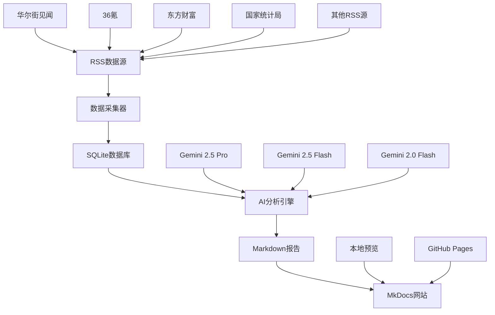

# 财经新闻采集与 AI 分析系统

一个可落地的财经新闻数据管道：多源 RSS 采集 → SQLite 汇总存储 → 可查询导出 → 调用大模型生成专业分析报告。

## 🚀 系统特色

- **多源 RSS 采集**：统一入库到 `data/news_data.db`
- **灵活内容抓取**：支持抓取正文 `content`（默认不截断）与摘要 `summary`
- **智能字段选择**：AI分析时可选择摘要优先、正文优先或智能选择
- **便捷查询导出**：按日期/来源/关键词查询并导出 CSV/JSON
- **AI 分析报告**：一键调用大模型生成专业 Markdown 报告
- **虚拟环境支持**：完整的 Python 虚拟环境配置，确保依赖隔离
- **交互式体验**：简化上手的交互式脚本，支持字段选择界面

## 📊 系统架构



## 🛠️ 快速开始

### 方式A：使用虚拟环境（推荐）
```bash
# 1. 激活虚拟环境（自动安装依赖）
./activate.sh                    # Linux/macOS
# 或
activate.bat                     # Windows

# 2. 配置API密钥
cp config/config.example.yml config/config.yml
# 编辑 config/config.yml，填写你的 Gemini API Key

# 3. 运行交互式脚本
python scripts/interactive_runner.py
```

### 方式B：一键脚本
```bash
bash scripts/setup.sh
python3 scripts/interactive_runner.py
```

## 📈 使用流程

1. **数据采集**：自动抓取多个财经RSS源的最新文章
2. **数据存储**：统一存储到SQLite数据库，支持去重和增量更新
3. **AI分析**：调用Gemini模型生成专业的财经分析报告
4. **报告展示**：自动生成MkDocs网站，支持本地预览和在线部署

## 🔧 核心功能

### 数据采集
- 支持20+个主流财经RSS源
- 可选择性抓取正文内容
- 自动去重和增量更新
- 支持按来源过滤

### AI分析
- 多模型支持（Gemini系列）
- 智能字段选择（摘要/正文/自动）
- 可配置分析参数
- 生成结构化Markdown报告

### 文档生成
- 自动生成MkDocs网站
- 支持本地预览和在线部署
- 响应式设计，支持移动端
- 全文搜索功能

## 📁 项目结构

```
Financial-report/
├── config/                      # 配置文件
│   ├── config.example.yml       # 配置模板
│   └── config.yml               # 实际配置（git忽略）
├── data/
│   └── news_data.db             # 主SQLite数据库
├── docs/
│   └── archive/YYYY-MM/YYYY-MM-DD/  # 历史报告归档
├── scripts/
│   ├── rss_finance_analyzer.py  # RSS数据采集
│   ├── ai_analyze.py            # AI分析引擎
│   ├── interactive_runner.py    # 交互式运行器
│   └── utils/                   # 工具模块
├── venv/                        # Python虚拟环境
├── activate.sh                  # 虚拟环境激活脚本
└── requirements.txt             # Python依赖
```

## 🎯 使用场景

- **个人投资者**：获取专业的市场分析和投资建议
- **财经研究员**：快速收集和分析市场信息
- **量化交易**：作为数据源和分析工具
- **学习研究**：了解AI在财经分析中的应用

## 📊 技术栈

- **后端**：Python 3.12+
- **数据库**：SQLite
- **AI模型**：Google Gemini API
- **文档生成**：MkDocs + Material主题
- **数据采集**：feedparser + requests
- **虚拟环境**：venv

## 🔄 更新日志

- **2025-09-30**：完成虚拟环境配置和打印优化
- **2025-09-30**：集成MkDocs文档生成功能
- **2025-09-30**：优化交互式脚本，支持字段选择
- **2025-09-29**：完善RSS数据采集和AI分析功能
- **2025-09-28**：系统基础架构搭建完成

## ⚠️ 免责声明

本项目输出仅供参考，不构成任何投资建议。投资有风险，入市需谨慎。

## 📄 许可证

MIT License - 详见 [LICENSE](LICENSE) 文件

---

*最后更新：2025-09-30*
