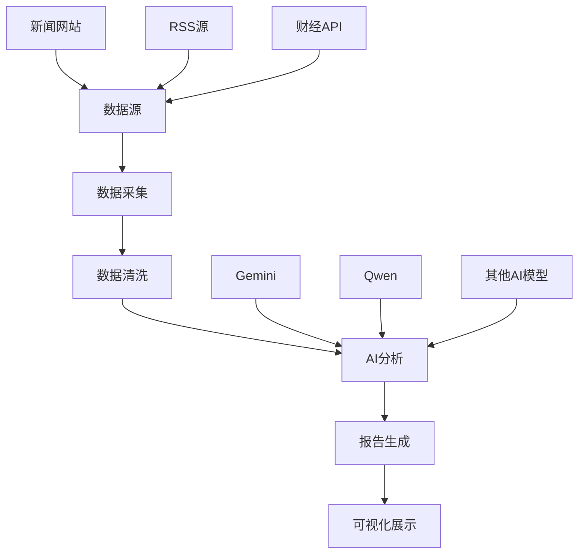

# 财经分析报告系统

欢迎使用基于AI的财经分析报告生成系统！

## 系统简介

本系统通过自动化收集财经新闻、RSS数据源，结合AI分析技术，生成专业的财经分析报告。系统支持多种AI模型，包括Gemini、Qwen等，为用户提供全面的市场分析和投资建议。

## 主要功能

### 📊 智能分析
- **市场热点分析**：自动识别当前市场热点话题
- **潜力话题挖掘**：发现具有投资潜力的新兴话题
- **股票推荐**：基于分析结果提供股票投资建议

### 📰 数据源整合
- **多源新闻采集**：整合华尔街见闻、36氪、东方财富等权威媒体
- **RSS数据聚合**：实时获取最新财经资讯
- **数据清洗处理**：自动处理和分析原始数据

### 🤖 AI驱动
- **多模型支持**：支持Gemini、Qwen等多种AI模型
- **智能报告生成**：自动生成结构化的分析报告
- **可视化展示**：提供图表和可视化分析结果

## 快速开始

1. **查看最新报告**：在左侧导航中选择"分析报告"
2. **浏览历史数据**：按月份和日期查看历史分析
3. **了解系统配置**：查看"工具配置"了解系统设置

## 系统架构

## 更新日志

- **2025-09-28**：系统正式上线，支持基础分析功能
- **2025-09-28**：集成Gemini和Qwen双模型支持
- **2025-09-28**：实现自动化报告生成和部署

## 技术支持

如有问题或建议，请通过以下方式联系：

- 📧 邮箱：your-email@example.com
- 🐛 问题反馈：[GitHub Issues](https://github.com/your-username/Financial-report/issues)
- 📖 文档：[项目文档](https://github.com/qipeijun/Financial-report)

---

*最后更新：2025-09-28*
